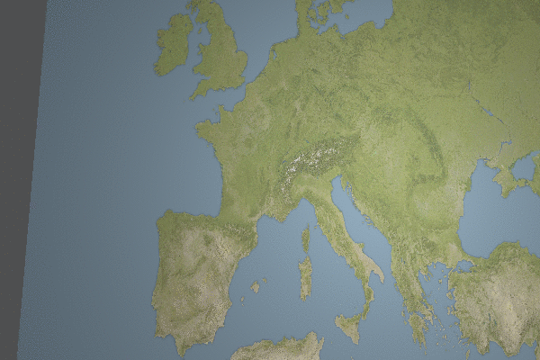

GiV - P1
----------  

IMPORTANT: per executar el codi cal afegir el flag -pthread a l'execució a IntelliJ o consola.

Abstract
^^^^^^^^

A aquesta pràctica hem implementat un sistema de renderització 3D amb sistema de Raytracing implementat
mitjançant l'aproximació de Blinn-Phong per als colors. Aquest sistema és capac de renderitzar figures bàsiques (triangles, esferes, cilindres, plans, plans acotats...) i complexes mitjancant meshs i afegint-li textures i diferents materials. La renderització és optimitzada utilitzant càlculs en paral·lel. Aquest sistema permet utilitzar figures geomètriques per representar dades en un món virtual fent diverses transformacions i aplicant diferents materials (lambertià, transparent, metàlic i textura) i colors a cadascuna de les figures.

Features
^^^^^^^^

- Figures
    - [Rubén] Triangle
    - [Manuel] Cilynder
    - [Rubén-Manuel] Boundary Object
    - [Eudald - Albert] Geometric Transformations
- Blinn-Phong
    - [Manuel] Light
    - [Manuel] Basic Blinn-Phong
    - [Rubén] Reflection
    - [Manuel, Rubén y Eudald] Transparency
- Material
    - [Manuel] Metal
    - [Manuel-Rubén y Eudald] Transparent
    - [Manuel-Eudald] Texture
- Data 
    - [Eudald - Albert] Data Reading
    - [Eudald] Data Visualization Mapping
    - [Eudald] Plane Texture Mapping

Extensions
^^^^^^^^^^

**1.** Múltiple scattering - Majoritàriament implementat per Rubén. (Ha ajudat Manuel)

**2.** Anti-aliasing a partir d'oversampling de rajos - Implementat per Rubén

**3.** Ombres i penombres: Implementat  majoritariament per Manuel, ha ajudat Rubén. 

**4.** Distinció rajos de reflexió - transparència, dóna la possibilitat de donar-li cert grau de 
transparència a material no transparents - Implementat majoritariament per Rubén. Ajuda de Manuel. 
(Retorna rajos de transpàrencia si són implementats amb la constant kt = 1 - component especular)

Afegida la possibilitat de possar llums als fitxers de text - Implementat per Rubén , amb el format:

* Posicio 01:    Focus X
* Posicio 02:    Focus Y
* Posicio 03:    Focus Z
* Posicio 04:    Material ambient X
* Posicio 05:    Material ambient Y
* Posicio 06:    Material ambient Z
* Posicio 07:    Material difusa X
* Posicio 08:    Material difusa Y
* Posicio 09:    Material difusa Z
* Posicio 10:    Material especular X
* Posicio 11:    Material especular Y
* Posicio 12:    Material especular Z
* Posicio 13:    a0
* Posicio 14:    a1
* Posicio 15:    a2

**5.** Atenuacions de les ombres de múltiples objectes transparents [Manuel i Eudald]:

* 5.1 [Manuel] Modificació de la classe IntersectionInfo per a que contempli un nou atribut (d) que guarda la distància recorreguda per un raig per l'interior d'un objecte.
     
* 5.2 [Manuel] Modificació dels mètodes intersection dels objectes definits en el projecte (Esferes, Cilindres, PlaneFigures) per a que es calculi la distància recorreguda del raig per l'interior de l'objecte fins que surt del mateix (en el cas de les PlaneFigures sempre 0).
    
* 5.1 [Manuel] Fer override del operador < en la classe IntersectionInfo per tal de poder ordenar vectors d'objectes del tipus IntersectionInfo comparant el valor de t (a menor valor de t més a prop es troba l'objecte).
    
* 5.2 [Manuel] Creació d'un mètode que retorni un vector d'objectes IntersectionInfo amb tots els objectes que intersecta el raig ordentats de més proper a més llunyà.
    
* 5.3 [Manuel i Eudald] Modificació del mètode getShadowFactor per a què recorri la llista d'objectes intersectats pel raig i mentres trobi objectes transparents disminueixi el shadowFactor. El shadowFactor es un color que s'inicialitza a (1,1,1), i cada objecte multiplica el shadowFactor per la seva "transparència efectiva".
    
* 5.4 [Eudald] La transparència efectiva d'un objecte es calcula tenin en compte la transparència del material, i la distància de col·lisió dins de l'objecte. 
    

  

  

    
    

**6.** [Ruben] Paral·lelització render amb tasques asíncrones: Per millorar la eficiència global de l'algorisme.

    
**7.** [Eudald i Albert] Nou DataReader modificat per crear escenes amb dades animades. El fitxer de dades animades té un format nou. Primer es defineixen les dimensions, propietats, i posicions dels objectes. I després es defineixen els valors de les dades amb blocs de 'frame'.  

  
  

**8.** [Eudald] Creació de llums alineades en un pla acotat per generar l'efecte de llum en àrea.

**9.** [Eudald] Nova variable del material Metall, que representi la pulidesa. Aquesta variable serveix per fer una suma ponderada dels vectors del Scatter entre el vector difús i el vector especular. També fa una suma ponderada dels color difús i especular.

Screenshots
^^^^^^^^^^^
Test funcionament creació d'objectes amb materials a partir de fitxers de text

.. image:: ./screenshoots/2png
  :width: 600
  :alt: Test funcionament creació d'objectes amb materials a partir de fitxers de text

Comprobació escena fase 3

Additional Information

Comprobació ombres transparents en objectes metàlics.

Comprobació ombres transparents en objectes metàlics traspasant objectes transparents

Comprobació escena fase 2 part 1

Correcció d'il·luminació amb múltiple scattering DEPTH=1:

Correcció de transparències amb múltiple scattering DEPTH=1:

Resultat final de fase 2 amb penombres, materials transparents,
transparències, ombres transparents complexes DEPTH=10

Resultat final de fase 2 amb penombres, materials transparents,
transparències, ombres transparents complexes

Demostració de materials semitransparents amb color, en aquest cas blau:

  
Demostració d'una escena de dades amb més d'una propietat:

    
Demostració d'un objecte de malla (perdó per la mala renderització):

    

Additional Information
^^^^^^^^^^^^^^^^^^^^^^
Problema principal 1: Acné Blinn-Phong model. Especialment amb materials lambertians. Temps dedicat a cercar
una epsilon que maximitzés la qualitat de la imatge. (Aproximàdament 4 hores amb implementació i millora en ombres, reflexions, etc).

Problema principal 2: Comprovar que els rajos provinguèssin del propi material: Inicialment Rubén va implementar-ho canviant
signatures de mètodes i comprovant igualtats entre referències d'objectes, però per indicació de Manuel es va emprar
el mètode de comprovar l'angle generat. (aproximadament 3 hores en el mètode complet)

Problema principal 3: Refactor sceneReader - Com que vam crear molts materials diferents hi havien moltes combinacions d'objectes
diferents i el codi de scene reader i objectFactori quedava molt brut i poc legible. Es va aplicar un refactor complet per acceptar 
tot tipus d'objectes amb tot tipus de materials, incloent llums puntuals.

Problema principal 4: Ombres d'elements transparents: calcular el width dels elements transparents [Manu completa]

Problema principal 5: Gran bug amb algorisme recursiu: No sumaba bé els valors dels rajos reflectats: Després de 2 hores de cerca es va trobar l'error on hi havia una desviació sutil en la suma ponderada. Un cop solucionat ja ens va donar les mateixes imatges que les mostrades a la fase 2 més apart totes les implementacions extres.

Temps dedicat
^^^^^^^^^^^^^

**NOTA**: *Volem recalcar que encara que la implementació de les diverses parts les hem fet separades, Manuel i Rubén han treballat junts(per videoconferència i presencial) la major part del temps, i una gran quantitat de temps no mesurable ha estat otorgada a comprovar la qualitat de codi de l'altre, fent code reviews i tests a cada part de codi modificada/creada, per tant hi ha hores no mesurades que hem realitzat entre els dos i la classificació anterior, al menys la part de Rubén, no creu (ell) que sigui justa assignar-se-la només a ell ja que ha sigut un treball en parella, o programant o comprovant la qualitat del codi de l'altre.*

**RUBEN**

- Fase 1 [6+ hores]: Completar juntament amb Manuel la primera part de la pràctica (fase 1) definir triangle, interseccions amb triangle, conjunt mesh, interseccions amb el mesh, creació d'objectes sense material amb el factory virtual. Creació d'escenes.

- Fase 2: [16+ hores]: Parts opcionals explicades a additional information, configuració de raytracing recursiu a partir del model Blinn Phong bàsic desenvolupat per Manuel, materials transparents, rajos transparents, ombres bàsiques, refactor de constructor d'objectes i creacions d'escenes a partir d'objectes.

- Fase 3: [5+ hores]: Creació de templates per crear dades en el món de dades virtual, correcció d'errors en les altres pràctiques. Paral·lelització del algorisme de render.

**MANUEL**

- Fase 1 [11+ hores]: Implementar la classe Cylindre amb tots els mètodes necessaris com per exemple la intersecció. També implementar classe Disk per a poder modelitzar les tapes de Cylindre. Dissenyar una classe PlaneFigure de la que heretaran  totes les figures planes com ho són Disk i Triangle juntament amb en Ruben. Petita ajuda amb classe Triangle i BoundaryObject. Tot això a a més testejar i corretjir alguns errors.(Realment en fer això vaig trigar aprox. 8 hores però vaig destinat unes 3 hores o més en que el projecte hem poguès compilar amb les llibreries). 

- Fase 2 [16+ hores]: Implementació de les llums amb les seves classes, la implementació bàsica de Blinn-Phong permetint diverses llums. Col·laborar amb en Ruben per implementar les transparències (classes i algoritmes). Implementar la classe Metal amb els seus mètodes com scatter. A més a més, he implementat parts addicionals explicades amb anterioritat, com per exemple permetre l'atenuació del shadowFactor al creuar múltiples objectes transparents, modificant la classe IntersectionInfo, els mètodes de intersecció que teniem implementats per a retornar el grux de l'objecte atravessat pel raig i modificant a més a més, el mètode de getShadowFactor per tal usar aquest canvis i fer-ho possible.

- Fase 3 [3+ hores]: Implementar classes i mètodes bàsics de Textures (MaterialTexture). 

**EUDALD**

- Fase 1[8+ hores] Completar las classes DataReader: llegir les dades, afitar l'escena, transformar els valors... Completar la classe SceneFactory. Crear la classe FittedPlane.
- Fase 2[4+ hores] Ombres de colors i transparències tenin en compte la profunditat dels objects.
- Fase 3[15+ hores] Mappejar textures a un pla. Creació d'escenes. Creació d'una classe per llegir i crear escenes de dades animades.

**ALBERT**

- Fase 1[6+ hores] Completar la classe SceneFactory. Crear la classe FittedPlane. Implementar les transformacions geomètriques.
- Fase 2[2+ hores] -
- Fase 3[13+ hores] Creació d'una classe per llegir i crear escenes de dades animades. Creació d'animacions.
